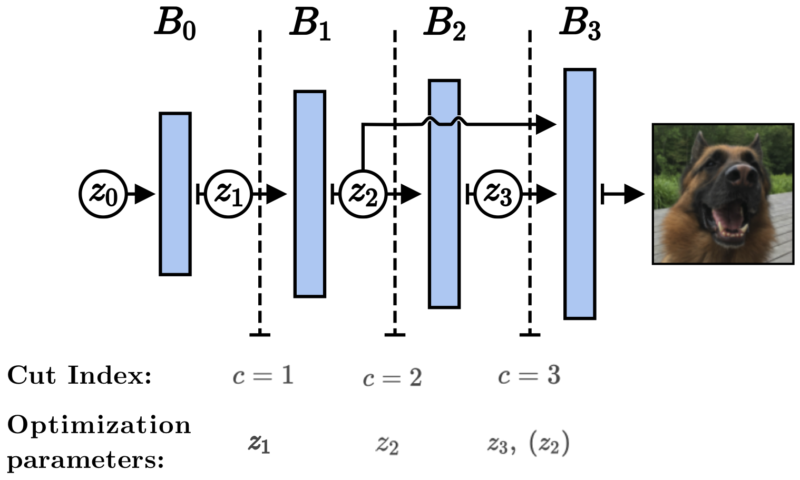

# Generator Surgery for Compressed Sensing
by Jung Yeon Park\*, Niklas Smedemark-Margulies\*, Max Daniels, Rose Yu, Jan-Willem van de Meent, and Paul Hand

(\*) equal contribution

**TL;DR**: In this work, we show that cutting initial layers of a generative signal prior at test time improves image recovery performance.

# Abstract

Recent work has explored the use of generator networks with low latent dimension as signal priors for image recovery in compressed sensing. However, the recovery performance of such models is limited by high representation error. We introduce a method to reduce the representation error of such generator signal priors by cutting one or more initial blocks at test time and optimizing over the resulting higher-dimensional latent space. Experiments demonstrate significantly improved recovery for a variety of architectures. This approach also works well for out-of-training-distribution images and is competitive with other state-of-the-art methods.  Our experiments show that test-time architectural modifications can greatly improve the recovery quality of generator signal priors for compressed sensing

<p align="center">
    
</p>                                                                                            

# Requirements

To install requirements:

```bash
pip install -r requirements.txt
```

# Datasets and Preprocessing

The 'train' and 'test' split for all models come from the [CelebA dataset](http://mmlab.ie.cuhk.edu.hk/projects/CelebA.html), at different resolutions.

For BigGAN model, we use [CelebAHQ dataset](https://github.com/tkarras/progressive_growing_of_gans)

The 'out-of-distribution' split comes from the [COCO 2017 Test dataset](http://images.cocodataset.org/zips/test2017.zip) (See [COCO website](http://cocodataset.org/#download) for more details).

Images are preprocessed by center cropping, and saving to tensors for faster training.

A 95:5 train:test split is used.

1. Download the aligned Celeba dataset. This can be done using PyTorch in a python REPL as follows:

    Note that the CelebA google drive has limited downloads per day, so if this fails, the contents of the `*.zip` files will be junk, and you must wait and try again.

    ```python
    import torchvision.datasets as d
    c = d.CelebA('./data', download=True)
    ```

2. Now you should have a folder `./data/celeba/img_align_celeba`. Run the preprocessing:

    ```bash
    DATASET=celeba # For DCGAN, use DATASET=celeba64x64
    IMG_SIZE=128 # For DCGAN, use IMG_SIZE=64
    DATASET_DIR=${DATASET}_preprocessed
    python data/preprocess_images.py --dataset $DATASET \
      --input_dir ./data/celeba \
      --output_dir ./data/${DATASET_DIR} \
      --img_size 64 \
      --n -1
    ```

# Training Generative Models

Before training, you should have run preprocessing as described in [Datasets and Preprocessing](#datasets-and-preprocessing).

## [BEGAN](model/began.py)
To start training:

```bash
python train_began.py --dataset celeba \
  --dataset_dir ./data/${DATASET_DIR} \
  --batch_size 32 \
  --run_name training \
  --latent_dim 64 \
  --epochs 50 \
  --n_train -1
```

To monitor training:
```bash
tensorboard --logdir ./tensorboard_logs
```

## [DCGAN](model/dcgan.py)
To start training:
```bash
python train_dcgan.py
```

To monitor training:
```bash
tensorboard --logdir ./dcgan_tensorboard_logs
```

## [VAE](model/vae.py)
To train VAE:
```bash
python train_vae.py --epochs 20
```

To monitor training:
```bash
tensorboard --logdir ./vae_tensorboard_logs
```

## [BigGAN](model/biggan.py)
BigGAN's model definition is a patched version of the pre-trained model provided by [Hugging Face](https://github.com/huggingface/pytorch-pretrained-BigGAN/).

# Running Inverse Imaging Experiments
Our experiments are launched for a fixed set of inverse problems, using fixed optimization hyperparams, for an entire folder of images at a time.

In [settings.py](settings.py), each scenario is described with a keyword, and listed once under `forward_models` (describing the recovery tasks that will be performed), and once under `recovery_settings` (describing the optimization hyperparams that will be used).

To prepare an experiment, copy the desired images to a folder, such as `images/ood-examples`.

For example, performing compressed sensing using BEGAN is described by `began_cs`.
To run the `began_cs` scenario:
```bash
python run_experiments --img_dir ./images/ood-examples --model began_cs
```

To run an experiment and also store Tensorboard logs, use:
```bash
MODEL=began_cs python run_experiments --img_dir ./images/ood-examples --model ${MODEL} --run_dir ${MODEL} --run_name ${MODEL}
```
... and then track progress in tensorboard using:
```bash
tensorboard --logdir ./recovery_tensorboard_logs
```
